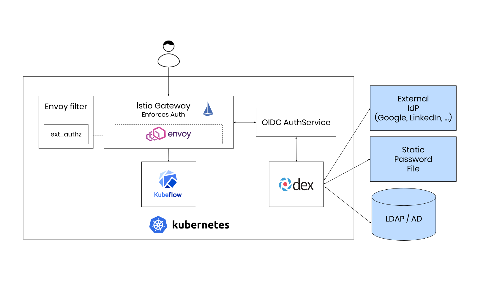
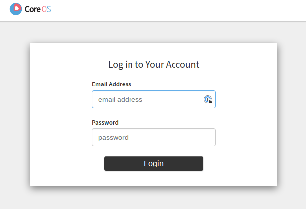
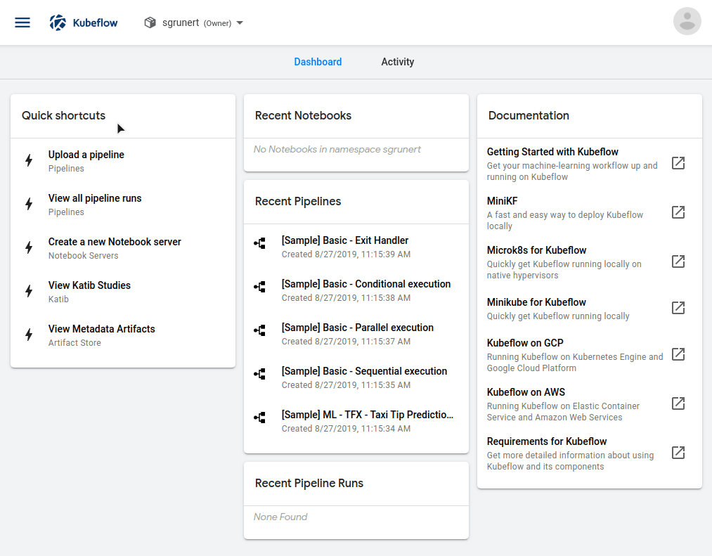
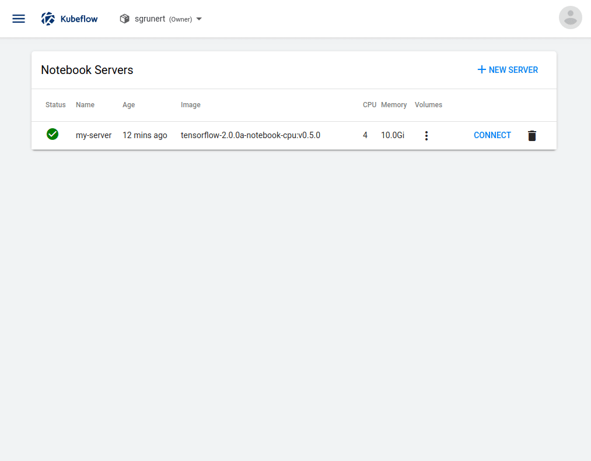
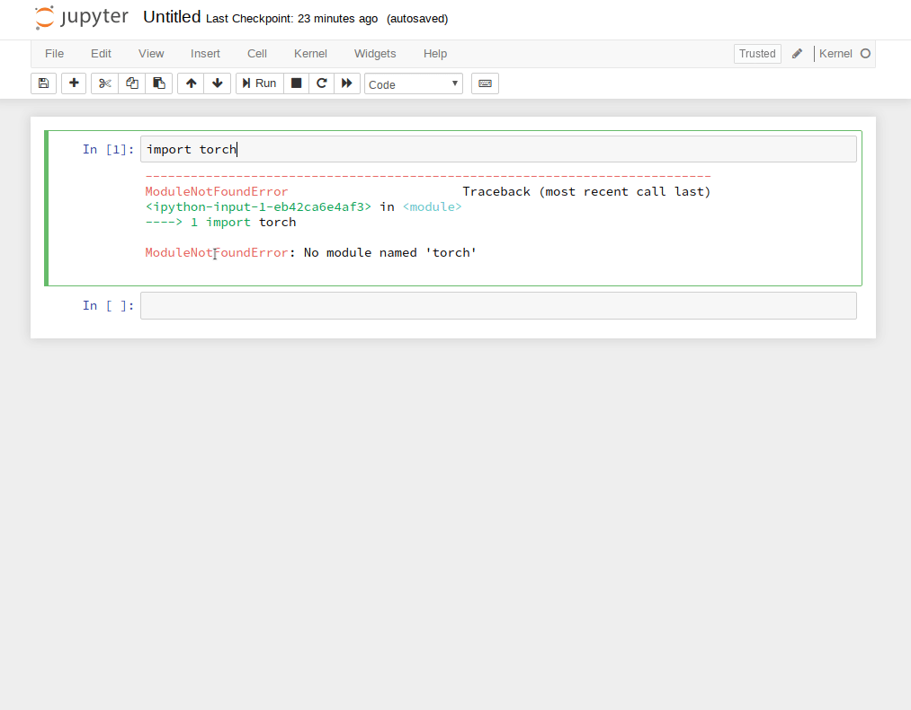
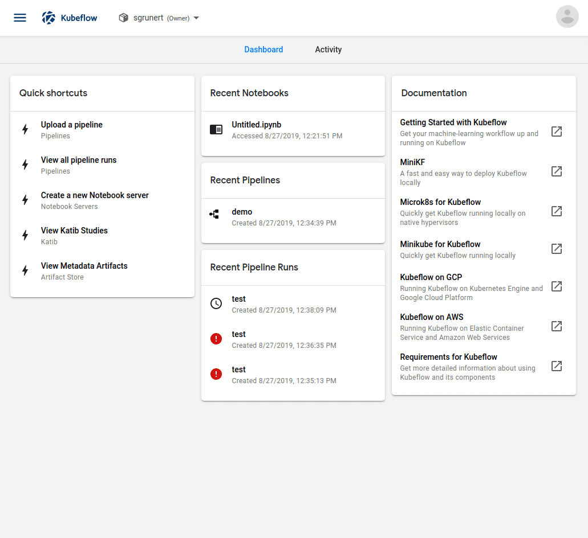
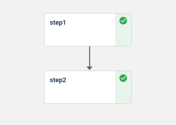

# Kubeflow - Data Science on Steroids

> Welcome to the blog post and corresponding talk about Kubeflow. This is a
> project of [mbu93](https://github.com/mbu93) and
> [saschagrunert](https://github.com/saschagrunert). Feel free to open issues if
> you have questions or want to provide feedback to us.

You can find the blog post:

- within this repository
- [on SUSE](https://suse.com/c/kubeflow-data-science-on-steroids)
- [on Medium](https://medium.com/p/60fc3ba92b06)

The corresponding talk can be found:

- [on Meetup](https://meetu.ps/e/H2ygp/tbX1P/a)

The slides of the talk:

- [on Slides.com](https://slides.com/saschagrunert/kubeflow)

# Table of Contents

- [About](#about)
- [Data Science on Steroids with Kubeflow](#data-science-on-steroids-with-kubeflow)
  - [The Evolution of Machine Learning](#the-evolution-of-machine-learning)
  - [The Classic Data Science Workflow](#the-classic-data-science-workflow)
  - [Yet Another Machine Learning Solution?](#yet-another-machine-learning-solution-)
    - [Kubernetes and Cloud Native Applications](#kubernetes-and-cloud-native-applications)
    - [Kubeflow to the Rescue](#kubeflow-to-the-rescue)
  - [The Deployment and Test Setup](#the-deployment-and-test-setup)
    - [Kubernetes](#kubernetes)
    - [Storage Provisioner](#storage-provisioner)
    - [Load Balancing](#load-balancing)
    - [Deploying Kubeflow](#deploying-kubeflow)
  - [Improving the Data Scientists Workflow](#improving-the-data-scientists-workflow)
    - [Cloud Native Notebook Servers](#cloud-native-notebook-servers)
    - [Machine Learning Pipelines](#machine-learning-pipelines)
    - [Machine Learning Pipelines within Notebooks](#machine-learning-pipelines-within-notebooks)
    - [Continuous Integration Lookout](#continuous-integration-lookout)
  - [Conclusion](#conclusion)

## About

Artificial intelligence, machine and deep learning are probably the most hyped
topics in software development these days!

New projects, problem solving approaches and corresponding start-ups pop up in
the wild on a daily basis. Most of the time, the major target is to get an
understandable output from a huge set of unmanageable input data. To achieve
this goal, the in fact standard frameworks [TensorFlow][0] and [PyTorch][1]
established a rich set of features over time by being well maintained under the
hood, too. But the simple usage of these frameworks does not solve today’s
software related challenges like continuous integration (CI) and deployment
(CD). The creation of a sustainable workflow, which embeds seamlessly into the
existing infrastructure as well as existing CI/CD pipelines, are one of the
major obstacles software developers are facing today.

[0]: https://www.tensorflow.org
[1]: https://pytorch.org

Another trend related to this topic is the increasing usage of Kubernetes as
build and test infrastructure for on premise and managed cluster architectures.
But how to utilize the full power of Kubernetes-based cloud environments, when
it comes to training and deploying machine learning models? How to integrate
them into existing continuous integration and deployment pipelines? Can we split
up machine learning workflows into separate pipeline steps, like we already do
within our existing CI/CD setups?

In this talk and corresponding blog post we will discover the possibilities to
utilize the joint forces of Kubernetes and Data Science. For this we have chosen
to elaborate [Kubeflow][2], one of the most common open
source cloud native platforms for machine learning.

[2]: https://www.kubeflow.org


Kubeflow is a project which is dedicated to making deployments of machine
learning workflows on Kubernetes simple, portable and scalable. It is a
relatively young project which aims to provide a complete machine learning
toolkit on top of Kubernetes.

Join us and we will discover the exciting features of Kubeflow together, like
spawning and managing [Jupyter][3] servers and creating our very own machine
learning pipelines from scratch.

[3]: https://jupyter.org

## Data Science on Steroids with Kubeflow

Before we dive into the cloud native topics and Kubeflow, let’s just have a look
back at the history of machine learning and artificial intelligence at all.

### The Evolution of Machine Learning

Machine learning has its origins in the early 1950s, where the first machines
like the [Stochastic Neural Analog Reinforcement Calculator (SNARC) Maze
Solver][4] appeared in the wild. The SNARC machine is known as the first
Artificial Intelligence (AI) neural network ever built and it already contained
synapses which were capable of storing their result in some kind of internal
memory.

[4]: https://en.wikipedia.org/wiki/Stochastic_neural_analog_reinforcement_calculator

But let’s fast forward to the early 2000s, where the industry created the first
software based machine learning frameworks which should revolutionize the world
of computing. [Torch][5], one of the first software libraries built for machine
learning, was initially released in 2002. Other more on scientific computing
specialized frameworks like [NumPy][6] were created around 2006, and a
massive flood of machine learning tools and frameworks were released since then.
[TensorFlow][7], [PyTorch][8] and [Pandas][9] are only some of the big players
in machine learning today. Most of these frameworks are built to be used from
the [Python][10] programming language, which itself gained a massive boost
regarding its popularity because of this booming industry around artificial
intelligence.

[5]: https://torch.ch
[6]: https://numpy.org
[7]: https://tensorflow.org
[8]: https://pytorch.org
[9]: https://pandas.pydata.org
[10]: https://python.org

The multi-disciplinary field of Data Science utilizes the methods of machine
learning as well as their rich tooling landscape to solve problems from the
statistical perspective. But what are these guys really doing from day to day
and how does their workflow currently look like?

### The Classic Data Science Workflow

First of all, we have to mention that there is no magic recipe when it comes to
solving data scientific problems. Nevertheless, we still do similar steps in
all these sorts of diverging solution approaches.

The source of the data to be analyzed is one common example. For sure, the input
data will change over time, but the technology how to obtain these data mostly
stays fixed. As a data scientist we also have no direct influence on this source.
So for example, we could always use the latest database dump of the last week,
which will produce different results over time. If the data got imported, we
mostly process them via Python based Jupyter notebooks, to be able to annotate
and layout our research approach even better.

Now that we have our data at hand, we have to decide which data exploration
approach we’d like to use. We have to answer questions like “Do we need
supervised or unsupervised learning?” and “Can we solve the problem with
classification or regression?”. This for sure highly depends on the actual
use case, but the common baseline is simply trying it out and building models
around the different solution approaches. We call this step _baseline modelling_
and use one of this powerful Python based machine learning frameworks out there.
We can do this by not leaving the Jupyter notebook at all, which is pretty nice
when working alone. But how to handle this when the problems get bigger and we
have to collaborate with others? How to handle the resource limitations my
workstation or the single remote server instance has?

Let’s skip the answers to these questions for now and follow up with the next
step: The results communication. We now have a solution, a model which can be
trained, and some first results to share. This is where it gets tricky
sometimes. We have to choose a deployment method and find out how to update the
model on a regular basis. The automatisms behind that are mostly custom
solutions which fit on the single dedicated use case for what they are made for.
If we don’t have a clear understanding of the infrastructure, then this part can
get messy. Finding an automated way to process the input data from the database
into a well-served resulting model gets even harder if the model has to be
updated periodically.

### Yet Another Machine Learning Solution?

So, there seems an already well established data science workflow and we have to
ask ourself if we really want to have yet another machine learning solution in
the wild. In our case, the answer is a big “YES”, because we know that the
current situation is not satisfying at all. We want to choose a software
solution which at least targets to solve all our main issues we had in the past,
so why not choose something _cloud native_?

#### Kubernetes and Cloud Native Applications

The wording “cloud native” basically means that the applications run in
container-based environments. But we have to distinguish between applications
which are aware of running in a distributed system and those which are not. The
latter are called _commercially available of-the-shelf_ (COTS) applications,
like a WordPress based blog. This application is fully controlled by its
environment and has no direct influence on it. We call applications cloud native
if they are aware that they run inside a distributed system like Kubernetes and
utilize its API to modify anything within the cluster. These applications are on
one hand much more powerful, but on the other hand less flexible when it comes
to the deployment because they’re now bound to its target system.


To build a cloud native application, we have to split it up into microservices
and maybe use modern software architectural approaches like
[service meshes][11]. One of the most well-known approaches today is to use
Kubernetes, which provides mainly all of the features we need to deploy a modern
cloud native application.

[11]: https://en.wikipedia.org/wiki/Microservices#Service_mesh

The major question is now: “Can we improve the classic data scientists workflow
by utilizing Kubernetes?”. We absolutely can! But Kubernetes alone won’t help us
a lot, which means that we have to choose an appropriate cloud native solution
on top, like the machine learning toolkit [Kubeflow][12].

[12]: https://www.kubeflow.org

#### Kubeflow to the Rescue

Kubeflow has been announced [around two years ago in 2017][13] with the main
target to make machine learning stacks on Kubernetes easy, fast and extensible.
The major goal of Kubeflow is to abstract machine learning best-practices, so
that data scientists do not really need to understand what is happening in
detail under the hood.

[13]: https://kubernetes.io/blog/2017/12/introducing-kubeflow-composable

A lot of improvements happened to the project since its initial announcement,
but in the end Kubeflow targets to be an umbrella project to close the gap
between common use cases like running [JupyterHub][14] servers or deploying
machine learning models based on TensorFlow or PyTorch. To do this, Kubeflow
re-uses existing software solutions and wraps them in their own abstraction of a
cloud native application by leveraging the features of Kubernetes.

[14]: https://jupyter.org/hub

Kubeflow today is a fast evolving project which has many contributors from the
open source industry. Nevertheless, it aims to be an easy-to-use software
project, which should also apply to the deployment of Kubeflow itself. But since
it is using multiple software components, the overall deployment of Kubeflow is
not that trivial as it may look like. This means we should spend some time to
wrap our heads around the used test setup for the following demonstration
purposes.

### The Deployment and Test Setup

Please be aware that Kubeflow is a rapidly evolving software and the code
examples may be out of date in the near future. If this is the case, feel free
to reach out to me anytime. From now on we will focus on the latest available
deployment strategy for bare metal or virtual machine (VM) based Kubernetes
clusters. It is for sure possible to deploy Kubeflow on [Google Cloud or Amazon
Web Services][15], but this is out of scope of this blog post.

[15]: https://kubeflow.org/docs/started/cloud

#### Kubernetes

First of all, we have to built up a Kubernetes cluster which fulfills a set of
common requirements. To do this, we have chosen a beta of SUSE’s upcoming
release of SUSE CaaS Platform, [SUSE CaaS Platform 4][16]. This comes with some
well chosen components under the hood, like the [CRI-O][17] container runtime
and [Cilium][18] for networking purposes. We utilized the new SUSE CaaS Platform
bootstrapping tool [skuba][19] to rapidly set up an [OpenStack][20] based
Kubernetes environment on top of four already existing SUSE Linux Enterprise
Server 15 SP1 ([SLES][21]) machines.


[16]: https://suse.com/betaprogram/caasp-beta
[17]: https://cri-o.io
[18]: https://cilium.io
[19]: https://github.com/SUSE/skuba
[20]: https://openstack.org
[21]: https://suse.com/products/server

We initialize the cluster under the current working directory:

```bash
> skuba cluster init --control-plane 172.172.172.7 caasp-cluster
> cd caasp-cluster
```

Then we bootstrap the master node:

```bash
> skuba node bootstrap --target 172.172.172.7 caasp-master
```

And now we join the three worker nodes:

```bash
> skuba node join --role worker --target 172.172.172.8  caasp-node-1
> skuba node join --role worker --target 172.172.172.24 caasp-node-2
> skuba node join --role worker --target 172.172.172.16 caasp-node-3
```

That’s it, with the usage of the automatically downloaded `admin.conf` we should
be able to access the Kubernetes cluster:

```
> cp admin.conf ~/.kube/config
> kubectl get nodes -o wide
NAME           STATUS   ROLES    AGE  VERSION   INTERNAL-IP      EXTERNAL-IP   OS-IMAGE                              KERNEL-VERSION           CONTAINER-RUNTIME
caasp-master   Ready    master   2h   v1.15.2   172.172.172.7    <none>        SUSE Linux Enterprise Server 15 SP1   4.12.14-197.15-default   cri-o://1.15.0
caasp-node-1   Ready    <none>   2h   v1.15.2   172.172.172.8    <none>        SUSE Linux Enterprise Server 15 SP1   4.12.14-197.15-default   cri-o://1.15.0
caasp-node-2   Ready    <none>   2h   v1.15.2   172.172.172.24   <none>        SUSE Linux Enterprise Server 15 SP1   4.12.14-197.15-default   cri-o://1.15.0
caasp-node-3   Ready    <none>   2h   v1.15.2   172.172.172.16   <none>        SUSE Linux Enterprise Server 15 SP1   4.12.14-197.15-default   cri-o://1.15.0
```

The cluster is completely production ready and comes with strong security
features like apparmor and pre-defined [Pod Security Policies][22] (PSPs).

[22]: https://kubernetes.io/docs/concepts/policy/pod-security-policy

#### Storage Provisioner

For running Kubeflow on top of our deployed cluster, we have to setup a [Storage
Provisioner][23], where we will use the [Network File System
(NFS)][24] as underlying technology for sake of simplicity. Before setting up
the provisioner, we install the `nfs-client` on all nodes for storage
accessibility. We’d chose `caasp-node-1` as NFS server, which needs some
additional setup:

[23]: https://kubernetes.io/docs/concepts/storage/dynamic-provisioning
[24]: https://en.wikipedia.org/wiki/Network_File_System

```
> sudo zypper in -y nfs-kernel-server
> sudo mkdir -p /mnt/nfs
> echo '/mnt/nfs *(rw,no_root_squash,no_subtree_check)' | sudo tee -a /etc/exports
> sudo systemctl enable --now nfsserver
```

This is for sure not production ready in terms of failure safety, but should be
enough for our test setup. Now we can install the Kubernetes storage provisioner
by using the latest pre-release of the package manager [Helm 3][25], which comes
without a server side deployment:

[25]: https://github.com/helm/helm

```
> helm install nfs-client-provisioner \
    -n kube-system \
    --set nfs.server=caasp-node-1 \
    --set nfs.path=/mnt/nfs \
    --set storageClass.name=nfs \
    --set storageClass.defaultClass=true \
    stable/nfs-client-provisioner
```

The storage provisioner should now be available up and running:

```
> kubectl -n kube-system get pods -l app=nfs-client-provisioner -o wide
NAME                                      READY   STATUS    RESTARTS   AGE   IP            NODE           NOMINATED NODE   READINESS GATES
nfs-client-provisioner-777997bc46-mls5w   1/1     Running   3          2h    10.244.0.91   caasp-node-1   <none>           <none>
```

#### Load Balancing

We also need a load balancer for accessing the cluster. For this we’d chose
[MetalLB][26], which works great with Cilium. To install it, we run:

[26]: https://metallb.universe.tf

```
> kubectl apply -f https://raw.githubusercontent.com/google/metallb/v0.8.1/manifests/metallb.yaml
```

Then we have to deploy a configuration, where we only need one single IP for
accessing Kubeflow (`172.172.172.251`) later on:

```
> cat metallb-config.yml
```

```yaml
---
apiVersion: v1
kind: ConfigMap
metadata:
  namespace: metallb-system
  name: config
data:
  config: |
    address-pools:
    - name: default
      protocol: layer2
      addresses:
      - 172.172.172.251-172.172.172.251
```

```
> kubectl apply -f metallb-config.yml
```

If you run MetalLB on OpenStack, please be aware that the networking has to be
configured to allow IP spoofing to make the assigned IPs reachable.

#### Deploying Kubeflow

We utilize the Kubeflow internal deployment tool [kfctl][27], which has been
highly rewritten from scratch to replace a now deprecated shell script. The tool
can consume multiple types of configurations, where we decided to choose the
[Arrikto][28] configuration for vendor neutral authentication via [Dex][29] and
[Istio][30]. It is worth to mention that there exists a [new Istio based
configuration][31], which should be free from any external dependencies, where
the above mentioned load balancer would not be needed at all.

[27]: https://github.com/kubeflow/kubeflow/tree/1fa142f8a5c355b5395ec0e91280d32d76eccdce/bootstrap/cmd/kfctl
[28]: https://github.com/kubeflow/kubeflow/blob/1fa142f8a5c355b5395ec0e91280d32d76eccdce/bootstrap/config/kfctl_existing_arrikto.yaml
[29]: https://github.com/dexidp/dex
[30]: https://github.com/istio/istio
[31]: https://github.com/kubeflow/kubeflow/blob/1fa142f8a5c355b5395ec0e91280d32d76eccdce/bootstrap/config/kfctl_k8s_istio.yaml

With an installed and up-to-date `kfctl` client, we’re now able to bootstrap the
Kubeflow application into our Kubernetes cluster. First, we have to initialize
the application:

```
> kfctl init kfapp --config=https://raw.githubusercontent.com/kubeflow/kubeflow/1fa142f8a5c355b5395ec0e91280d32d76eccdce/bootstrap/config/kfctl_existing_arrikto.yaml
```

Then we can set the default credentials for our testing purposes:

```bash
> export KUBEFLOW_USER_EMAIL="sgrunert@suse.com"
> export KUBEFLOW_PASSWORD="my-strong-password"
```

And now install the application:

```
> cd kfapp
> kfctl generate all -V
> kfctl apply all -V
```

The overall architecture of the deployed application looks now like this, where
we skipped the LDAP authentication part in replacement of the statically
exported credentials.



Now, we should be able to access Kubeflow via the exposed IP of the Istio
Gateway.

```
> kubectl -n istio-system get svc istio-ingressgateway
NAME                   TYPE           CLUSTER-IP       EXTERNAL-IP       PORT(S)                                                                                                                                                     AGE
istio-ingressgateway   LoadBalancer   10.102.112.227   172.172.172.251   5556:31334/TCP,15020:30057/TCP,80:31380/TCP,443:31390/TCP,31400:31400/TCP,15029:32004/TCP,15030:30908/TCP,15031:32568/TCP,15032:32127/TCP,15443:31037/TCP   4m23s
```

In our case, the problem is that our local machine is not part of the subnet
where Kubernetes is deployed. But this obstacle can easily be overcome with a
NAT redirection and by utilizing the possibilities of [kube-proxy][32]:

[32]: https://kubernetes.io/docs/reference/command-line-tools-reference/kube-proxy

```
> sudo iptables -t nat -A OUTPUT -p all -d 172.172.172.251 -j DNAT --to-destination 127.0.0.1
> sudo kubectl -n istio-system port-forward svc/istio-ingressgateway 443 &
> kubectl -n istio-system port-forward svc/istio-ingressgateway 5556
```

If we now access `https://localhost` from our browser, then all traffic should
be correctly routed to our local machine and after skipping the HTTPs security
warnings the first login screen should appear:



We can now authenticate with our pre-defined username and password. Here we are,
welcome to the Kubeflow Central Dashboard:


Some first indicators already hint us to the fact that we’re running a cloud
native application. For example, it looks like that Kubeflow created a
Kubernetes namespace for us where we can work in. Let’s dive into the
application itself since we finally have a working installation.

### Improving the Data Scientists Workflow

#### Cloud Native Notebook Servers

For example, with Kubeflow it is easily possible to create per-user Jupyter
notebook servers:



This notebook server is now running as [StatefulSet][33] in the Kubernetes
cluster within my personal namespace:

[33]: https://kubernetes.io/docs/concepts/workloads/controllers/statefulset

```
> kubectl -n sgrunert get pods,statefulsets
NAME              READY   STATUS    RESTARTS   AGE
pod/my-server-0   2/2     Running   0          3m7s

NAME                         READY   AGE
statefulset.apps/my-server   1/1     3m7s
```

We can also see that a persistent NFS storage has been provided for the notebook
server as well:

```
> kubectl -n sgrunert get pvc
NAME                  STATUS   VOLUME                                     CAPACITY   ACCESS MODES   STORAGECLASS   AGE
workspace-my-server   Bound    pvc-cd92e3a5-0be4-4ced-af91-b15ac5601f9b   10Gi       RWO            nfs            4m38s
```

Let’s connect to the notebook server and test if it’s working as we would expect
it:



Nice, this works like every other usual Jupyter Hub notebook. The major benefit
by running it inside Kubeflow is that we don’t have to worry about the hardware
constraints at all. We specified in Kubeflow that we want to spawn a notebook
server with 4 CPUs and 10GiB of RAM, where Kubernetes will complain if it’s not
able to fulfill these resource requirements. During the creation of the
notebook server we specified a pre-defined base image on top of TensorFlow. But
what if we want to use another machine learning framework like PyTorch inside
it? Well, we could either create our own base image, which contains all the
dependencies. This is surely the recommended way because it means that
everything still exist on re-creation of the notebook server pod. For our
demonstration purpose, we simply install it inside the running container. We
could do this either via the notebooks web interface, or even more cloud native
by simply using `kubectl`:

```
> kubectl -n sgrunert exec -it my-server-0 -c my-server bash
root@my-server-0:~# conda install pytorch-cpu torchvision-cpu -c pytorch
Collecting package metadata: |
```

Now we should be able to use PyTorch within the notebook server as well, which
wasn’t working before:



#### Machine Learning Pipelines

Kubeflow provides reusable end-to-end machine learning workflows via pipelines.
This feature comes with a complete [Python SDK][41], where the data scientist
does not have to learn a new language to use it. A pipeline consists of multiple
components, which can be described by:

[41]: https://kubeflow.org/docs/pipelines/sdk

- Creating a `ComponentOp` which will directly run commands within a referring
  base image
- Using lightweight Python functions that will be run within a base image
- Building more complex logic from Python functions using Google Cloud Platform
  (GCP)

How could such a pipeline look like? For the first scenario, we created a pseudo
pipeline called `demo`. This pipeline can be executed in so-called
_experiments_, which looks like this:



Every pipeline step is executed directly in Kubernetes within its own pod,
whereas inputs and outputs for each step can be passed around too. Kubeflow is
also able to display graphics like receiver operating characteristic (ROC)
charts or confusion matrices. All in all, a single trivial pipeline step would
look like this Python snippet:

```python
from kfp.dsl import ContainerOp

step1 = ContainerOp(name='step1',
                    image='alpine:latest',
                    command=['sh', '-c'],
                    arguments=['echo "Running step"'])
```

This step would do nothing else than echoing "Running step". To bring multiple
steps into dependency with each other, we could create a second `step2` and run:

```python
step2.after(step1)
```

A complete pipeline example would look like this, where we have to outline it
with `@pipeline` and compile it afterwards via `compile()`:

```python
from kfp.compiler import Compiler
from kfp.dsl import ContainerOp, pipeline


@pipeline(name='My pipeline', description='')
def pipeline():
    step1 = ContainerOp(name='step1',
                        image='alpine:latest',
                        command=['sh', '-c'],
                        arguments=['echo "Running step"'])
    step2 = ContainerOp(name='step2',
                        image='alpine:latest',
                        command=['sh', '-c'],
                        arguments=['echo "Running step"'])
    step2.after(step1)


if __name__ == '__main__':
    Compiler().compile(pipeline)
```

This kind of pipeline component can especially be useful for deployment tasks,
or even querying for new data. The downside of this approach is the need for
an executable to be run. Typical data science tasks, like training a model
would require a dedicated training script to be available as part of the base
image.

This approach may get a little impractical considering the fact that data
science tasks quite often consist of short one-line code snippets. Due to that,
Kubeflow offers the possibility to create lightweight components from Python
directly. Such a component may look like this:

```python
from kfp.components import func_to_container_op

def sum_sq(a: int, b: int) -> int:
    import numpy
    dist = np.sqrt(a**2 + b**2)
    return dist

add_op = func_to_container_op(sum_sq)(1, 2)
```

Running this pipeline would deliver the inputs sum of squares as the pipelines
output. Even though, this approach can really reduce the afford to describe a
component, but there are a few restrictions to be considered:

- Lightweight functions need to be standalone, so they may not use code, imports
  or variables defined in another scope.
- Imported packages needs to be available in the container image.
- Input parameters needs to be set to `str` (default), `int` or `float` which
  are the only types currently supported (Google Cloud Platform provides methods
  to overcome this limitation)

This is due to the fact, that the Kubeflow will internally create an executable
command similar to:

```bash
python -u -c "def sum_sq(a: int, b:int):\n\
                import numpy\n\
                dist = np.sqrt(a**2 + b**2)\n\
                return dist\n(...)"
```

Respecting all these limitations, a lightweight component for training a model
may look like this:

```python
from kfp.components import func_to_container_op


def fit_squeezenet(pretrained: bool = False):
    from fastai.vision import cnn_learner, accuracy, models
    name: str = "squeezenet.model"
    loader = ImageDataBunch.from_folder("test/images",
                                        train="training",
                                        valid="test",
                                        size=112)
    learner = cnn_learner(loader,
                          models.squeezenet1_0,
                          pretrained=pretrained,
                          metrics=accuracy,
                          silent=False,
                          add_time=True)

    learner.fit_one_cycle(1)
```

We could also split up components by saving and loading output from or to a
persistent volume. Our pipeline would then look somewhat like this:

```python
from kfp.components import func_to_container_op


def fit_squeezenet(loader: str,
                   storage: str,
                   pretrained: bool = False,
                   name: str = "squeezenet.model") -> str:
    import dill
    from fastai.vision import cnn_learner, accuracy, models
    import codecs

    with open(outpath, "rb") as fp:
        learner = dill.load(fp)

    loader = dill.loads(codecs.decode(loader.encode(), "base64"))
    learner = cnn_learner(loader,
                          models.squeezenet1_0,
                          pretrained=False,
                          metrics=accuracy,
                          silent=False,
                          add_time=True)
    learner.fit_one_cycle(1)

    outpath = storage + "/" + name
    with open(outpath, "wb") as fp:
        dill.dump(learner, fp)

    return outpath


op = func_to_container_op(fit_squeezenet,
                          base_image="alpine:latest")("out/model", False,
                                                      "squeeze.model")
op.add_volume(
    k8s.V1Volume(name='volume',
                 host_path=k8s.V1HostPathVolumeSource(
                     path='/data/out'))).add_volume_mount(
                         k8s.V1VolumeMount(name='volume', mount_path="out"))
```

For even complexer scenarios, creating a dedicated training script and executing
it within a `ContainerOp` directly as shown above may be the best best. Now that
we know how to properly describe a pipeline let’s see how to run one.

We have to compile the pipeline via the `dsl-compile` executable from the
pipelines SDK:

```
> sudo pip install https://storage.googleapis.com/ml-pipeline/release/0.1.27/kfp.tar.gz
> dsl-compile --py pipeline.py --output pipeline.tar.gz
```

The resulting tarball can now be uploaded to Kubeflow via the web dashboard and
executed there. If the pipeline run is done, then the graph should look
like this:



All pipelines are internally transformed to [Argo workflows][34] which are part
of the Argo CD application Kubeflow uses for its execution. With the help of the
[Argo CLI][35] we can examine the pipeline even further:

[34]: https://argoproj.github.io/argo
[35]: https://github.com/argoproj/argo-cd/releases/tag/v1.1.2

```
> kubectl get workflow
NAME                AGE
my-pipeline-8lwcc   6m47s
```

```
> argo get my-pipeline-8lwcc
Name:                my-pipeline-8lwcc
Namespace:           kubeflow
ServiceAccount:      pipeline-runner
Status:              Succeeded
Created:             Tue Aug 27 13:06:06 +0200 (4 minutes ago)
Started:             Tue Aug 27 13:06:06 +0200 (4 minutes ago)
Finished:            Tue Aug 27 13:06:22 +0200 (4 minutes ago)
Duration:            16 seconds

STEP                  PODNAME                      DURATION  MESSAGE
 ✔ my-pipeline-8lwcc
 ├-✔ step1            my-pipeline-8lwcc-818794353  6s
 └-✔ step2            my-pipeline-8lwcc-768461496  7s
```

This should give us a good feeling about how Kubeflow uses third party software
to actually do the job.

Please note that we had to modify the pipelines to work on Kubernetes
deployments which are not running Docker as container runtime under the hood.
The full working examples can be found in [`0-demo.py`][36] and
[`1-demo.py`][37].

[36]: src/pipelines/0-demo.py
[37]: src/pipelines/1-demo.py

#### Machine Learning Pipelines within Notebooks

Jupyter notebooks are a very common choice for building and evaluating machine
learning models. As they can be run within Kubeflow with barely
one click, wouldn’t it be nice to additionally be in control over the pipeline
system from there as well? Luckily Kubeflow got your back!

By importing the _kfp.compiler_ package into a notebook the previous pipeline
steps can be done from a notebook directly. This also empowers us to create
experiments and pipeline runs in an integrated manner from within Jupyter. Let’s
say we have created a pipeline called `training_pipeline`. Then we would import
the `kfp` compiler and build the pipeline like this:

```python
from kfp.compiler import Compiler
pipeline_func = training_pipeline
pipeline_filename = pipeline_func.__name__ + '.pipeline.yaml'
Compiler().compile(pipeline_func, pipeline_filename)
```

This will put the pipeline definition to a YAML file and enable us to upload
this file to our pipeline endpoint. To do so let’s first of all create a new
experiment:

```python
import kfp
client = kfp.Client()

try:
    experiment = client.create_experiment("Prototyping")
except Exception:
    experiment = client.get_experiment(experiment_name="Prototyping")
```

Afterwards we can trigger a run directly from the Jupyter notebook:

```python
arguments = {'pretrained': 'False'}
run_name = pipeline_func.__name__ + ' test_run'
run_result = client.run_pipeline(experiment.id, run_name, pipeline_filename, arguments)
```

This will create a new run called `training_pipeline test_run` within an
experiment called `Prototype`. A neat feature is that a link to this experiment
will be shown immediately, which will lead to our dashboard where our run has
started:


We can also check if the pipeline structure is the expected one by clicking on
_View Pipeline_.


Neat! We have successfully deployed a pipeline from our notebook. There are a
few things that significantly can be seen as improvements to the classical
workflow. First of all, we have set up a reproducible way of handling our model.
If the pipeline fits our needs we could simply deploy it as a recurring run and
our model would stay up-to-date on a regular basis. On the other hand, we could
also use the pipeline system within the prototyping process to unblock us from
waiting for single steps in the notebook to be finished.

#### Continuous Integration Lookout

All our steps we did so far were more or less driven by manual intervention.
But to fully unleash the power of an automated CI/CD process, we would need to
somehow automate our workflow completely.

Luckily, Kubeflow provides a [pipelines REST API][38] which can be used for such
tasks. For demonstration purposes we now bypass the required authentication via
kube-proxy by executing:

[38]: https://kubeflow.org/docs/pipelines/reference/api/kubeflow-pipeline-api-spec

```
> kubectl port-forward -n kubeflow svc/ml-pipeline 8888
Forwarding from 127.0.0.1:8888 -> 8888
Forwarding from [::1]:8888 -> 8888
```

The API serves now on `localhost:8888`, where we’re able to upload our demo
project from the command line:

```
> dsl-compile --py 0-demo.py --output demo-0.tar.gz
> curl -F uploadfile=@demo-0.tar.gz http://localhost:8888/apis/v1beta1/pipelines/upload\?name=demo-0
{"id":"09f6113b-1646-4333-ba97-3008c046b5a6","name":"demo-0","created_at":"2019-08-30T09:10:45Z"}
```

A new run can now be started by utilizing the `runs` API and passing in the
correct `pipeline_id`, which is `09f6113b-1646-4333-ba97-3008c046b5a6` in our
case:

```
> curl http://localhost:8888/apis/v1beta1/runs -H 'Content-Type: application/json' \
        --data-binary '{
            "name":"my-run",
            "pipeline_spec": {
                "pipeline_id":"09f6113b-1646-4333-ba97-3008c046b5a6"
            }
        }' | jq .run.id
"0ee04b48-69c0-40e3-b286-683957fcc283"
```

We’re now able to track the results from the run by polling the API:

```
> curl http://localhost:8888/apis/v1beta1/runs/0ee04b48-69c0-40e3-b286-683957fcc283 | jq .run.status
"Succeeded"
```

Pretty great, a possible fully automated CI/CD workflow could now build the
pipeline via `dsl-compile`, push it into a new test experiment and create the
runs. If the run succeeds, then we could update the served model internally.
Kubeflow wouldn’t be Kubeflow if there would be no solution for that: [Serving
TensorFlow][39] or [PyTorch based models][40] is possible via Kubeflow too!

[39]: https://kubeflow.org/docs/components/serving/tfserving_new
[40]: https://kubeflow.org/docs/components/serving/pytorchserving

Covering this topic as well would go beyond of the scope of this blog post so we
will leave this open to your personal discovery session with Kubeflow.

### Conclusion

So, that’s it for now. We hope you enjoyed the read getting a feeling about cloud
native applications and Kubeflow. We think that Kubeflow has a bright future and
would like to encourage you to contribute to the project to support the
maintainers.
